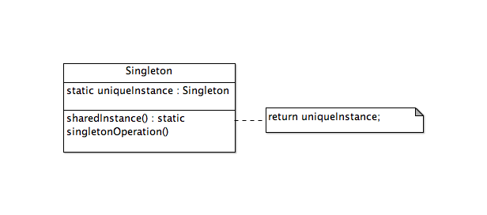
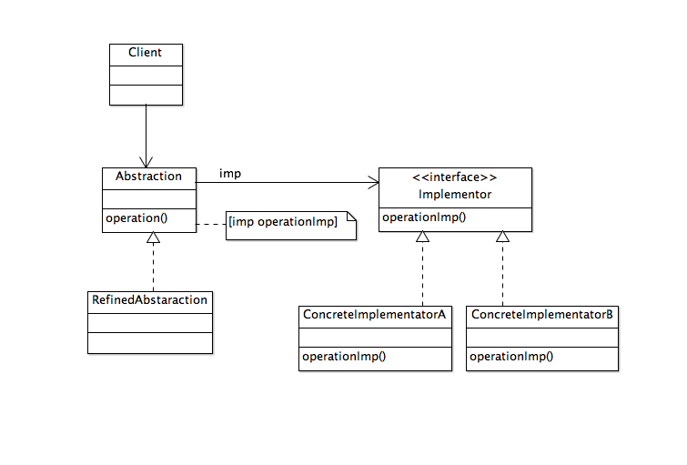
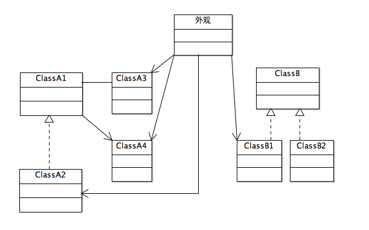

<!--BEGIN_DATA
{
    "create_date": "2016-05-29 21:05", 
    "modify_date": "2016-05-29 21:05", 
    "is_top": "0", 
    "summary": "《iOS设计模式解析》笔记2：单例模式、适配器模式、桥接模式、外观模式", 
    "tags": "设计模式", 
    "file_name": "《iOS设计模式解析》笔记2：单例模式、适配器模式、桥接模式、外观模式.md"
}
END_DATA-->

###单例模式

>保证一个类仅有一个实例，并提供一个访问它的全局访问点。

####使用情景

* 类只能有一个实例，而且必须从一个为人熟知的访问点对其进行访问，比如工厂方法
* 这个唯一的实例只能对过子类化进行扩展，而且扩展的对象不会破坏客户端代码

>单例类提供创建与访问类的唯一对象的访问点，并保证它唯一，一致而且为人熟知。这一模式提供了灵活性，使其任何子类可以重载实例方法并且完全控制自身的对象创建，而不必修改客户端的代码。更好的是，父类中的实例实现可以处理动态对象创建。类的实际类型可以在运行时决定，以保证创建正确的对象。

<strong>单例模式类图</strong>

###适配器模式

>将一个类的接口转换成客户希望的另外一个接口。适配器模式使得原本由于接口不兼容面不能一起工作的那些类可以一起工作。

####使用情景

* 已有类的接口与需求不匹配
* 想要一个可复用的类，该类能够同可能带有兼容接口的其他类协作
* 需要适配一个类的几个不同子类，可是让每一个子类去子类化一个类适配器又不现实，那么可以使用对象适配器(委托)来适配其父类的接口

####类适配器与对象适配器的对比

|  类适配品   |  对象适配器   |
|:-----------:|:-------------:|
| 只针对单一的具体Adaptee类，把Adaptee适配到Target | 可以适配多个Adaptee及其子类 |
| 易于重载Adaptee的行为，因为是通过直接的子类化进行的适配 | 难以重载Adaptee的行为，需要借助子类的对象而不是Adaptee本身 |
| 只有一个Adapter对象，无需额外的指针间接访问Adaptee | 需要额外的指针以间接访问Adaptee并适配其行为 |

 

#####类适配器

<strong>类适配器类图</strong>

>Adapter是一个Target类型，同时也是一个Adaptee类型。Adapter重载Target的request方法。但是Adapter没有重载Adaptee的specificRequest方法，而是在Adapter的request方法的实现中，调用超类的specificRequest方法。request方法在运行时向超类发送[super specificRequest]消息。super就是Adaptee，它在Adapter的request方法的作用域内，按自己的方式执行specificRequest方法。只有当Target是协议而不是类时，类适配器才能够用Objective-C来实现。

#####对象适配器

<strong>对象适配器类图</strong>

>Target和Adapter之间的关系跟类适配器相同，而Adapter和Adaptee之间的关系从“属于”变成了“包含”。这种关系下，Adapter需要保持一个对Adaptee的引用。在request方法中，Adapter发送[adaptee specificRequest]消息给引用adaptee，以间接访问它的行为，然后实现客户端请求的其余部分。由于Adapter与Adaptee之间是一种“包含”的关系，用Adapter去适配Adaptee的子类也没什么问题。

###桥接模式

>将抽象部分与它的实现部分分离，使它们都可以独立地变化。

####使用情景

* 不想在抽象与其实现之间形成固定的绑定关系(这样就能在运行时切换实现)
* 抽象及其实现都应可以通过子类化独立进行扩展
* 对抽象的实现进行修改不应该影响客户端代码
* 如果每个实现需要额外的子类以细化抽象，则说明有必要把它们分成两个部分
* 想在带有不同抽象接口的多个对象之间共享一个实现

<strong>桥接模式类图</strong>

###外观模式

>为系统中的一组接口提供一个统一的接口。外观定义一个高层接口，让子系统更易于使用。

####使用情景

* 子系统正逐渐变得复杂。应用模式的过程中演化出许多类。可以使用外观为这些子系统提供一个较简单的接口
* 可以使用外观对子系统进行分层。每个子系统级别有一个外观作为入口点。让它们通过其外观进行通信，可以简化它们的依赖关系

>当程序逐渐变大变复杂时，会有越来越多小型的类从设计和应用模式中演化出来。如果没有一种简化的方式来使用这些类，客户端代码最终将变得越来越大，越来越难理解，而且，维护起来会繁琐无趣。外观有助于提供一种更为简洁的方式来使用子系统中的这些类。处理这些子系统类的默认行为，可能只是定义在外观中的一个简单方法，而不必直接去使用这些类。

<strong>外观模式类图</strong>

