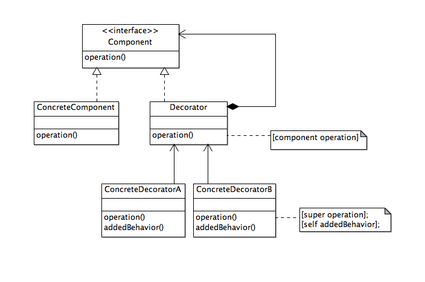
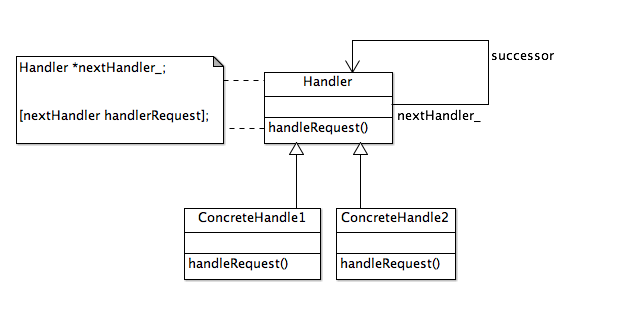
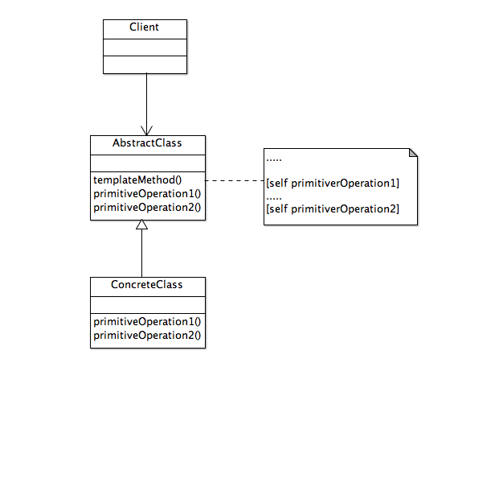

<!--BEGIN_DATA
{
    "create_date": "2016-06-02 21:34", 
    "modify_date": "2016-06-02 21:34", 
    "is_top": "0", 
    "summary": "《iOS设计模式解析》笔记4：访问者模式、装饰模式、责任链模式、模板方法模式", 
    "tags": "设计模式", 
    "file_name": "《iOS设计模式解析》笔记4：访问者模式、装饰模式、责任链模式、模板方法模式.md"
}
END_DATA-->

###访问者模式

>表示一个作用于某对象结构中的各元素的操作。它让我们可以在不改变各元素的前提下定义作用于这些的新操作。

####使用情景

* 一个复杂的对象结构包含很多其他对象，它们有不同的接口(比如组合体)，但是想对这些对象实施一些依赖于其具体类型的操作
* 需要对一个组合结构中的对象进行很多不相关的操作，但是不想让这些操作“污染”这些对象的类。可以将相关的操作集中起来，定义在一个访问者类中，并在需要在访问者中定义的操作时使用它
* 定义复杂结构的类很少作修改，但经常需要向其添加新的操作

>访问者模式有个需要注意的缺点，那就是，访问者与目标耦合在一起。因此，如果访问者需要支持新的类，访问者的父类和子类都需要修改，才能反映新的功能。不过，要是不经常往目标类家族中添加新类，也没什么大问题。
>
>由于将来对访问者的修改不可预见，为每个访问者准备一个“万能”的访问方法，来支持未来的目标类是个好主意。然而，这只是权宜之计，要是经常需要增加新节点，就应该下定决心，修改访问者的接口，以支持新的节点类型。

 

>访问者模式是个扩展组合结构功能的一种强有力的方式。如果组合结构具有精心设计的基本操作，而且结构将来也不会变更，就可以使用访问者模式，用各种不同用途的访问者，以同样的方式访问这个组合结构。访问者模式用尽可能少的修改，可以把组合结构与其它访问者类中的相关算法分离。

<strong>访问者模式的静态结构的类图</strong>

###装饰模式

>动态地给一个对象添加一些额外的职责。就扩展功能来说，装饰模式相比生成子类更为灵活。

####使用情景

* 想要在不影响其他对象的情况下，以动态、透明的方式给单个对象添加职责
* 想扩展一个类的行为，却做不到。类定义可能被隐藏，无法进行子类化；或者，对类的每个行为的扩展，为支持每种功能组合，将产生大量的子类
* 对类的职责的扩展是可选的

####装饰者模式与策略模式的差异的总结

| “外表”变更(装饰) | “内容”变更(策略) |
|:--------:|:--------:|
| 从外部变更 | 从内部变更 |
| 每个节点变更 | 每个节点知道一组预定义的变更方式|

 

>真正子类方式的实现使用一种较为结构化的方式连接各种装饰器。类别的方式则更为简单和轻量，适用于现有类只需要少量装饰器的应用程序。虽然类别不同于实际的子类化，不能实现装饰模式的原始风格，但它实现了解决同样问题的意图。

<strong>装饰模式的类图</strong>

<strong>装饰模式的一种实现，扩展了装饰性的功能</strong>

###责任链模式

>使多个对象都有机会处理请求，从而避免请求的发送者和接收之间发生耦合。此模式将这些对象连连成一条链，并沿着这条链传递请求，直到有一个对象处理它为止。

####使用情景

* 有多个对象可以处理请求，而处理程序只有在运行时才能确定
* 向一组对象发出请求，而不想显示指定处理请求的特定处理程序

<strong>责任链模式的类图</strong>

<strong>运行时的请求处理程序链的一种典型结构</strong>

###模板方法模式

>定义一个操作中算法的骨架，而将一些步骤延迟到子类中。模板方法使子类可以重定义算法的某些特定步骤而不改变该算法的结构。

####使用情景

* 需要一次性实现算法的不变部分，并将可变的行为留子类实现
* 子类的共同行为应该被提取出放到公共类中，以避免代码。现胡代码的差别应该被分离为新的操作。然后用一个调用这些新操作的模板方法来替换这些不同的代码
* 需要控制子类的扩展。可以定义一个在特定点调用“钩子”(hook)操作的模板方法。子类可以通过对钩子操作实现在这些点扩展功能

>钩子操作给出了默认行为，子类可对其扩展。默认行为通常什么都不做。子类可以重载这个方法，为模板算法提供附加的操作。
>
>模板方法模式中的控制结构流程是倒转的，因为父类的模板就去调用其子类的操作，而不是子类调用父类的操作。这与“好莱坞原则”类似：别给我们打电话，我们会打给你。

####模板方法会调用5种类型的操作：

1. 对具体类或客户端类的具体操作；
2. 对抽象类的具体操作；
3. 抽象操作；
4. 工厂方法；
5. 钩子操作；

####模板方法与委托的比较

>模板方法和委托模式(也叫适配器模式)常见于Cocoa Touch框架。它们对框架类设计来说是非常自然的选择。为什么呢？用户应用程序可以复用(或扩展)框架类，而且框架在设计时不会知道什么样的类会使用它们。可是对于特定的软件设计问题应该使用哪一种模式呢？以下是简要的指导方针。

 

| 模板方法 | 委托(适配器) |
|:-------:|:----------:|
| 父类定义一个一般算法，但缺少某些特定可选的信息或算法，它通过这些缺少的信息或算法起到一个算法“食谱”的作用 | 委托(适配器)与预先定义好的委托接口一起定义一个特定算法 |
| 缺少的信息由子类通过继承来提供 | 特定算法由任何对象通过对象组合来提供 |

 

>在框架设计中，模板方法模式相当常见。模板方法是代码复用的基本技术。通过它，框架的设计师可以把算法中应用程序相关的元素留给应用程序去实现。模板方法抽出共同行为放入框架类中的手段。这一方式有助于提高可扩展性与可复用性，而维持各种类(框架类与用户类)之间的松耦合。Cocoa Touch框架也采用了模板方法。在框架中经常能看到这些框架类，虽然不如Delegation那么常见。
>
>如：
>
>UIView中的drawRect方法；
>
>UIViewController中的viewDidLoad、shouldAutorateToInterfaceOrienation、roatingHeaderView.roatingFooterView等；

<strong>模板方法的类图</strong>

 

>ConcretClass重载AbstractClass的primitiverOperation1和primitiverOperation2，以Client调用AbstractClass中的templateMethod时提供独特的操作。

