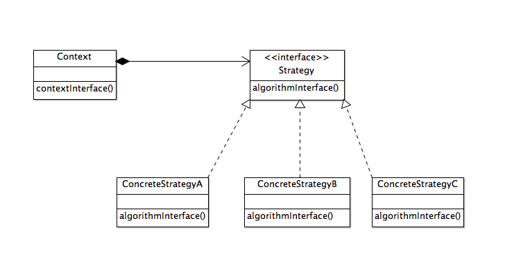
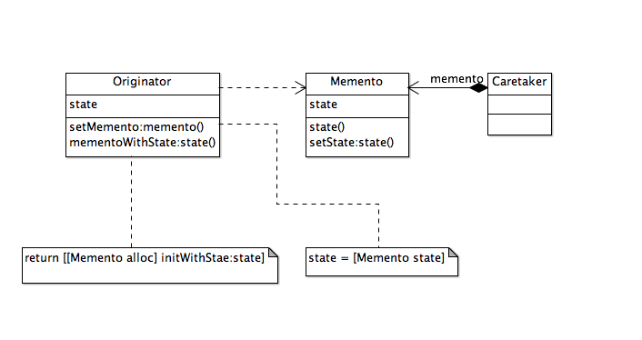

<!--BEGIN_DATA
{
    "create_date": "2016-06-05 23:11", 
    "modify_date": "2016-06-05 23:11", 
    "is_top": "0", 
    "summary": "《iOS设计模式解析》笔记5：策略模式、命令模式、享元模式、代理模式、备忘录模式", 
    "tags": "设计模式", 
    "file_name": "《iOS设计模式解析》笔记5：策略模式、命令模式、享元模式、代理模式、备忘录模式.md"
}
END_DATA-->

###策略模式

>定义一系列算法，把它们一个个封装起来，并且使它们可相互替换。策略模式使得算法可以独立于使用它的客户而变化。

####使用情景

* 一个类在其操作中使用多个条件语句来定义许多行为。我们可以把相关的条件分支移到它们的策略类中
* 需要算法的各种变体
* 需要避免把复杂的，与算法相关的数据结构暴露给客户端

####模型-视图-控制器中的策略模式

>模型-视图-控制器中，控制器决定视图对模型数据进行显示的时机和内容。视图本身知道如何绘图，但需要控制器告诉它要显示的内容。同一个视图如果与不同的控制器合作，数据的输出格式可能一样，但数据的类型和格式可能随不同控制的不同输出而不同。因此这种情况下的控制是视图的策略。

<strong>策略模式的类结构</strong>

###命令模式

>将请求封装为一个对象，从而可用不同的请求对客户进行参数化，对请求排队或记录请求日志，以及支持可撤销的操作。

####使用情景

* 想让应用程序支持撤销与恢复
* 想用对象参数化一个动作以执行操作，并用不同命令对象来代替回调函数
* 想要在不同时刻对请求进行指定，排列和执行
* 想记录修改日志，这样在系统故障时，这些修改可在后来重做一遍
* 想让系统支持事务，事务封装了对数据的一系列修改。事务可以建模为命令对象

>命令模式允许封装在命令对象中的可执行指令。这使得在实现撤销和恢复基础设施的时候自然会选择这个模式。但这个模式的用途不只如此。命令对象的另一个为人熟知的应用是推迟调用器的执行。调用器可以是菜单项或按钮。使用命令对象连接不同对象之间的操作相当常见，比如，单击视图控制器中的按钮，可以执行一个命令对象，对另一个视图控制器进行某些操作。命令对象隐藏了与这些操作有关的所有细节。

<strong>命令模式结构的类图</strong>

* Client(客户端)创建ConcreteCommand对象并设定其reciver
* Invoker要求通用命令(实际上是ConcreteCommand)实现请求
* Command是为了Invoker所知的通用接口(协议)
* ConcreteCommand起Reciver和对它的操作action之间的中间人的作用
* Reciver可以是随着由Command(ConcreteCommand)对象实施的相应请求，而执行实际操作的任何对象

###享元模式

>运用共享技术有效地支持大量细粒度的对象

####使用情景

* 应用程序使用很多对象
* 在内存中保存对象会影响内存性能
* 对象的多数特有状态(外在状态)可以放到外部而轻量化
* 移除了外在状态之后，可以用较少的共享对象替代原来的那组对象
* 应用程序不依赖于对象标识，因为共享对象不能提供唯一的标识

####通过享元对象能够节省的空间取决于几个因素：

1. 通过共享减少的对象总数
2. 每个对象内在状态(即，可共享的状态)的数量
3. 外在状态是计算出来的还是保存的

>然而，对享元对象外在状态的传递，查找和计算，可能产生运行时的开销，尤其在外在状态原本是作为内在状态来保存的时候。当享元的共享越来越多时，空间的节省会抵消这些开销。共享的享元越多，节省的存储就越多。节省直接跟共享的状态相关。如果对象有大量内在和外在状态，外在状态又能够计算出来而不用存储的时候，就能节省最大的空间。这样我们以两种方式节省了存储空间：共享减少了内在状态的开销，通过牺牲计算时间又节省了外在状态的存储空间。

<strong>享元模式的类图</strong>

>Flyweight是两个具体享元类ConcreteFlyweight1和ConcreteFlyweight2的父接口(协议)。每个ConcreteFlyweight类维护不能用于识别对象的内在状态instrinsicState。Flyweight声明了operation:extrinsticState方法，由这两个ConcreteFlyweight类实现。instricState是享元对象中可被共享的部分，而extrinsicState补充缺少的信息，让享元对象唯一。客户端向operation:消息提供extrinsicState，让享元对象使用extrinsicState中的独一无二的信息完成其任务。

<strong>运行时享元对象如何共享的对象图</strong>

###代理模式

>为其他对象提供一种代理以控制对这个对象的访问

####使用情景

* 需要一个远程代理，为位于不同地址空间或网络中的对象提供本地代表
* 需要一个虚拟代理，来根据要求创建重型的对象
* 需要一个保护代理，来根据不同访问权限控制对原对象的访问
* 需要一个智能引用代理，通过对实体对象的引用进行计数来管理内存。也能用于锁定实体对象，让其他对象不能修改它

>在iOS应用开发中，总是要关注内存的使用量。不论应用程序在何种设备上，出于性能的考虑，总是推荐懒加载技术，对开销大的数据实施懒加载，如文件系统中的大图像文件或者通过低速网络从服务器下载的大型数据。如果大开销的对象收到请求之前不需要加载，则可能过虚拟代理向客户端提供某些轻量的信息。

<strong>代理模式的类图</strong>

<strong>代理模式在运行时的一种可能的对象结构</strong>

###备忘录模式

>在不破坏封装的前提下，捕获一个对象的内部状态，并在该对象之外保持这个状态。这样以后就可以将该对象恢复到原先保存的状态

####使用情景

* 需要保存一个对象(或某部分)在某一个时刻的状态，这样以后就可以恢复到先前的状态
* 用于获取状态的接口会暴露实现的细节，需要将其隐藏起来

<strong>备忘录模式结构的类图</strong>

>当看管人请求Originator对象保存其状态时，Originator对象将使用其内部状态创建一个新的Memento实例。然后看管人保管Memento对象，或者把它保存到文件系统，一段时间后再把它传回给Originator对象。Originator对象不知道这个Menentor对象将如何被保存。看管人也不知道Memento对象里是什么。

<strong>备忘录模式的时序图</strong>

>这个设计的关键是维持Memento对象的私有性，只让Originator对象访问保存在Memento对象中的内部状态(即Originator过去的内部状态)。Memento类应该有两个接口：一个宽接口，给Originator用；一个窄接口，给其他对象用。时序图中，setState:、state和init方法应该定义为私有，不让Originator和Memento以外的对象使用。

