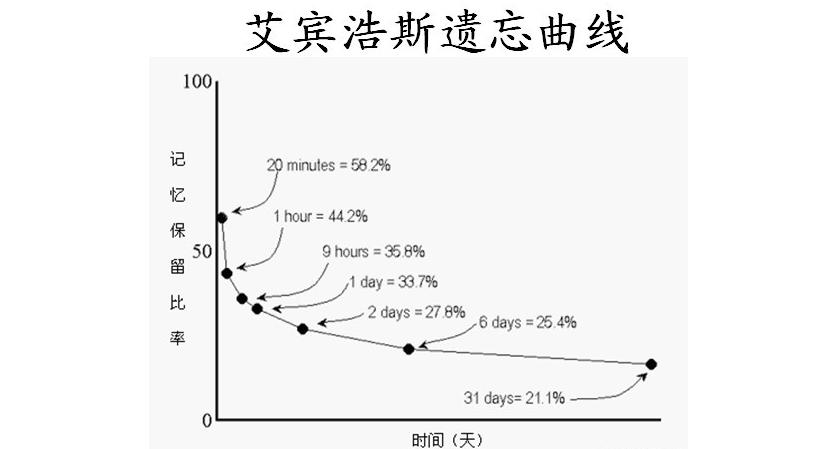

 
<!--BEGIN_DATA
{
    "create_date": "2016-12-01 15:03", 
    "modify_date": "2016-12-01 15:03", 
    "is_top": "0", 
    "summary": "如何阅读一本书？", 
    "tags": "日常", 
    "file_name": "如何阅读一本书？.md"
}
END_DATA-->

<!--
####
原文出处：<a href='http://conndots.github.io/2016/11/19/how_read_a_book/' target='blank'>如何阅读一本书？</a>

-->

##你会读书吗？

对于一个上过学的人来讲，如果问你『你会读书吗？』，我想大多数人都会说，我特么就是读书考试长大的。堂堂的大学生不会读书？事实上，我自己是硕士毕业，已经工作一年有余了，扪心自问，我会读书吗？答案还真没那么确定。

##为什么读书？

现代人，有了电视和互联网，娱乐方式千奇百怪，即使是学习方式也是五花八门。我们充斥在各种短小的新闻资讯、鸡汤中，大家都在倡导碎片化阅读，倡导多媒体学习，通过读书来提高自己的方式成了『古董』。 
 
无法否认的是，读书的投入产出比对于许多情景来说确实不高。比如，对于一个程序员，学习一项新技术的最佳学习方式是通过官网的tutorial、通过他人的博客分享迅
速上手，实践出真知，而非等待专业人士出一本书，然后读书学习。

但是，令人惊讶的是，**只是掌握知识的提纲并不会提高你的专业水平。当然，掌握它们可以解决手上的问题。**[1] 举例来说，对一个程序员，通过到处都是的博客和
tutorial，迅速学习了Rails，或者Spring、Netty等看起来复杂无比的框架，搭起来了一个很像样的服务，解决了眼前的需求。这能说明你是一个学习能力很强，上手很迅速的人。但是重复地为了上手、应用目的的学习不同的工具、框架并无法跟你投入的精力成正比地提高你的专业能力。

> [1] 参见Klemp, G. O. "Three Factors of Success" in _Related Work and Education_与"Identifying the Knowledge which Underpins Performance" in _Knowledge_，还有_Competence: Current Issues in Education and Training_。

**大脑构建的模型、为构建模型所提出的问题和你的日常经验和实践对你的能力成长更加重要。它们才能提高你的竞争力和专长。仅仅掌握知识是不够的。你需要持续的目标，需要及时的反馈以了解你的进展，需要更加主动全面地学习。** 

主动学习需要良好设定的目标，和合理、科学的计划，可以参考之前的文章《[[方法论] 2017来了，如何设定目标，如何制定计划？](http://conndots.github.io/2016/11/13/target_and_plan/)。正确的主动学习需要几个方面（参考《程序员的思维修炼》主动学习章节）：

  * 主动学习。
  * 结合实践。
  * **及时获取反馈，并针对反馈做针对性的训练、学习。** 这点通常会被很多人所忽略，事实上，**提供及时准确的反馈给学员以针对性训练**，是针对成年人的导师/教练/老师的最大价值。 （参考 《万万没想到：用理工科思维理解世界》：练习一万小时成天才？）

读书是一种具有良好best practice的、系统化的主动学习方法。本文的读书方法适合『严肃』阅读，目的是为了提高自己的能力与认知的阅读，而非『娱乐性』阅读，或者为了直接性功利目的阅读（考试、面试等）。阅读小说、青春疼痛文学、偶像小说、漫画等可以视为娱乐的一种。而许多教辅、教材的存在往往培养了我们错误的阅读习
惯。

关于读书的一些真相，这些问题也广泛存在于我自己的阅读之中（参考 《万万没想到：用理工科思维理解世界》：用强力研读书）：

  1. **大多数人都没有严肃阅读**。
  2. **看这些严肃的书的人大多都没有看完**。统计：kindle电子书大部分只看了四分之一，标注越到后面越少。比如一些有名的书，《思考，快与慢》：6.8%。《时间简史》：6.6%。《二十一世纪资本论》：2.4%。我自己《思考，快与慢》只看了一半。
  3. **看完了和没有看差不多。很快就忘记了，甚至就没有看懂**。这个对于我自己就很常见。看完了很多量子力学和相对论的科普书籍后，在分享会中，回答别人一个比较简单的问题的时候，仍然非常懵逼，而这个问题自己读书的时候其实想清楚过。

所以，读书需要方法论。而这个方法论，一定**不好玩**，一定会让你不舒服，需要刻意地实践，需要严肃与认真。

##阅读的目的和层次

> 本章节小结自《如何阅读一本书》。

所有主动的阅读（并非拿起书这种动作的主动性）的目的无非有两种：**为了获得资讯的阅读**和**为了提高理解能力的阅读**。  

前一种目的的阅读，可以说我们常提的碎片化阅读就是这样的阅读。这些资讯每天被我们吸收，但大部分时候也会迅速消失，并没有什么卵用。这里并非是『知识』，而只是『资讯』。如同你中学老师说的，『你脑子怎么长的，左脑袋进，右脑袋出？』。呵呵。

我们需要主动阅读，**越主动，效率越高**。所有的主动阅读，是努力在与作者沟通的过程。我们不仅仅满足于get作者想要表达什么，更要去思考，他为什么这么想？他到底想表达什么？他说的对吗？

而对于不同的场景，我们可以分为不同的层次，使用不同的方法阅读。

  * **基础阅读** 最低水平、摆脱文盲的阅读。这个没什么好说的，许多时候我们的阅读都存在于这个水平。
  * **检视阅读** 通常在有限时间内确定一本书的大体内容，或者粗读一本书，都属于检视阅读。
  * **分析阅读** 以增进理解力为目标的阅读，是自我要求较高的阅读方法，常应用于专业与相关领域的严肃阅读中。 为了把这本书彻底变成自己的，需要借助良好的读书笔记还有其他方法。《如何阅读一本书》里面对此有详细的论述，也可以参考知乎读者『寒山远火』的专栏文章：《如何阅读一本书》----读书方法的整理。
  * **主题阅读** 可以看做是你对你的专业领域，或者你想要进入的领域的一个话题的系统性的系列阅读。你需要比较同一个话题，不同的作者之间持有哪些互相冲突的看法，或者类似的看法。通过使用分析阅读的方法阅读同一个主题下的多本书，相互取长补短地学习，形成自己的知识框架。

《如何阅读一本书》是一本比较厚的书，还涉及了各种阅读不同类型书籍的不同方法。我其实想说《如何阅读《如何阅读一本书》》也是一个巨大的挑战。这本书不免过于学究。不如使用一些更加Practical的方法，更加注重实效，而非套路。

##A Practical Reader Should do

这里结合我的阅读经验，还有自己的实践，谈一谈作为一个practical reader，如何阅读。

###如何选择一本书

每个人都有不同的兴趣，如何选择一本合适的书，合自己口味的书，并不是一个简单的事情。这里有一些经验：

####1. 牛人推荐或者另一本书籍里提到的书

对于一些编撰比较专业的书来说，他们通常都有references和标注他们提到相关的观点的信息源。而许多博客里对于他们文章中涉及到的相关书籍或论文或作者也会有提及，如果你当前看的这篇博文或者书籍是你感兴趣的，那么他们推荐的相关的阅读，通常你也会感兴趣的。这些书籍，可以加到你的备选书单里。比如读完《暗时间》还有作者的博客[Mind Hacks](http://mindhacks.cn/)的文章后，我的豆瓣想读里添加了许多作者刘未鹏推荐的相关书籍。

####2. 豆瓣豆列或者你喜欢的公众号推荐的书单

还有就是豆瓣的豆列的作者往往都有收集癖，经常会把同一个主题的书籍收集到一个豆列里。许多阅读相关的公众号也会推送一些书单。

####3. 领域经典书籍

每个领域一定会有经典书籍，从它们触发，使用上面的方法宽度优先遍历，一定可以得到一个比较完整的领域书单。

####对书的筛选

一本书，到底值不值得自己读，也需要耗费一些精力。首先，我会去看豆瓣评分，过低分的书基本都会一票否决。对于书籍的评论，也会翻翻好评，还有最关键的：差评的内容。然后，就要使用『略读』方法确定这本书是不是你的菜了。简要来说，略读方法的要点是（来自《如何阅读一本书》）：

  1. 看书名，看序。把书可以归类。
  2. 看目录。经典的书籍通常目录就对书的内容作了系统的概括。
  3. 浏览索引，如果有的话。书中出现的高频词汇也反映了书的关键字。
  4. 挑几个感兴趣的章节来看。
  5. 随机挑几个段落来看。对于理论性的书籍，章节的开头与结尾值得一看。

当你选定一本书后，就可以开始阅读了。

###测试驱动阅读

####阅读方法论框架

《程序员思维修炼：开发认知潜能的九堂课》这本书提到了一种SQ3R的阅读方法[2]，SQ3R分别是如下内容的缩写：

  1. **S**urvey 调查：对应章节_如何选择一本书_里的选择、调研书的方法。
  2. **Q**uestion 问题：带着问题开始阅读，记录你的问题。
  3. **R**ead 阅读：阅读全部内容。
  4. **R**ecite 复述：总结，做读书笔记，用自己的话来叙述。
  5. **R**eview 回顾：重读，扩展笔记，写博客或者其他方式分享，与伙伴讨论。

> 概念来源参见[Francis Pleasant Robinson _Effective Study_](https://books.google.com/books/about/Effective_study.html?id=OsVrAAAAIAAJ)

这里需要强调的是Q，也就是在略读之后，我们需要针对整本书，还有每个章节，提出一些问题，记录下来，然后寻求验证。 如果你是一个程序员，在阅读一本技术书籍，比如Rails on the way，你首先要问：我为什么读这本书？Rails能为我的项目带来什么好处？它有什么缺点？ 本质上，Q是为了明确自己阅读的目的，让阅读更加紧密贴合自己的情境，更加有收获。

那么，你手里有本书，如何阅读？结合我自己的经验，你可能需要读两遍，按照下面的流程： 

（1）**略读，筛选，提问**经过了_如何选择一本书_这节提到的筛选、略读后，记录你关于这本书的问题，在读每一个章节之前也要记录你的问题。
  
（2）**粗读一遍** 从头到尾，阅读一遍。对于难以理解或者困难的部分，要避免耽误太多时间，可以跳过，避免一叶障目。 粗读对于一个上班族来说，很适合于在通勤交通工具上通过kindle或者手机app来进行。注意阅读速度并非一成不变的匀速，在遇到困难部分，降低速度来避免思维脱节。  

（3）**笔记** 第一遍阅读过程中，任何值得记录或者讨论的作者的观点或者事例可以标记下来，或者印象比较深刻的章节，在当天的空闲的时候，把他们整理成读书笔记
，记录在Evernote里（或者其他知识管理软件）。 

（4）**复述，讨论**如果有伙伴的话，当天可以把你阅读到的内容口头复述给你的伙伴听，可以是一个观点，一个事例，然后回答他们提出的问题。  

（5）**重读** 在粗读一遍后，根据自己的理解和评价，决定这本书的价值是否需要重读，哪些章节需要重读。这次，需要使用更高级的分析阅读的方式，针对部分章节，并且可以跳过一些不重要的内容，同时扩展你的读书笔记。  

（6）**分享，讨论** 可以通过豆瓣书评，写博客的方式分享你读书的见解，或者在读书分享会上分享你的读书收获，评价。积极讨论、分享，获得反馈。

####测试驱动阅读

**测试驱动阅读（TDR, Test Driven Reading）**的方法也来自于《程序员思维修炼：开发认知潜能的九堂课》的6.7节：使用SQ3R方法主动阅读。这个概念来自于软件开发领域的测试驱动开发（TDD，Test Driven Development）。

#####阅读中的测试

对于技术书籍来说，测试方法是显而易见的，就是把书中提到的技术应用到实践中。对于软件开发来说，测试成本比较低，可以快速地在自己的计算机上实践书中的技术。 当然有**更加通用的测试方法：Recite & Review（复述与回顾、讨论反馈）**。也就是我们在上面的方法论框架里提到的：

  1. 记录读书笔记（用自己的话记录，无视文笔、格式）。
  2. 把读书内容口头复述给同伴并讨论。
  3. 写博客小结自己在一个主题下的阅读成果并分享到博客/论坛里分享给别人，鼓励讨论。
  4. 组织学习小组或者读书小组，回顾、分享自己的读书成果，并讨论。

#####测试带来的记忆加成

测试除了通过回顾加深读书成果的记忆之外，还有主动学习中的**获得及时反馈**的效果，我们可以通过多种途径的反馈来针对性的改进我们的想法，促进我们的思考。《暗时间》中，有一个有意思的观点，**当我们把我们的想法写下来的时候（读书笔记，博客），我们对记录的想法的记忆也会更加深入。**记录读书笔记不仅是把想法记录
在了外部载体中，也促进了大脑对这些想法的整理。 

**人的记忆能力并非体现在我们记住了多少东西。**通常情况下，我们能够记住大部分的东西。**而在于，在需要的时候，我们能不能快速地找到这些信息**（理论上，当然可以遍历，然而我们的大脑非常不擅长枚举、遍历）。  

联想计算机的数据仓库，我们需要对数据建立合理、高效的索引，才能快速地找到数据。我们的大脑也是一样的，在记忆的时候，需要通过技巧对孤立的知识点建立更多的与其它
知识点的连接，如同数据库的索引一样，提高我们的记忆效果。

记录读书笔记，写作博文，复述，针对主题的讨论，都是提高记忆效果的有效手段。

#####利用间隔效应重复测试

因为人的记忆是会遗忘的，下图是著名的艾宾浩斯遗忘曲线。 

可以看到，在白天读书的当天晚上，我们的记忆就只会保留1/3，甚至更少。如果你想要记住一组知识，短时间高强度的记忆并无法提高你的记忆效果，而是需要利用间隔效用重复做阅读测试。比如可以按照2-2-2-6的规律重复测试，在2小时，2天，2周，6个月重复。  

重点不是严格按照这样的区间来严格测试，而是记住，高强度地重复记忆并不会提高你的记忆效果，你需要利用间隔效用。

###如何记读书笔记

那么，如何记录读书笔记便非常重要。

我曾经是这样记录读书笔记的，把书里重点的语句复制，甚至是重写在笔记里。显然，这样的笔记并没有带来效果。而常常自己也不写笔记，许多书读过，就忘记了大半了。

而许多现在很流行的读书app，比如微信阅读，读书的标记和笔记虽然相比kindle能够更加高效的记录，然而却不能导出，无论是导出到evernote，还是文字导出，只能图片导出（又是为了装逼的所谓社交需求）。微信阅读强调了把笔记分享到读书圈中，让我哭笑不得，只言片语的片段加上一个人的评论，除了骗赞、装逼，对于没有看过书的朋友们到底有什么用？

首先说，读书笔记不是什么：

  1. 重复书籍的片段。 重复书中的话是低效的，kindle的笔记和标记导出就可以做到，多看阅读也可以自动导出笔记到Evernote。
  2. 严格的文章。 完全不需要文笔，格式，手法，可以是任何载体，任何简略、快速的表达，但是需要整理。

你的笔记需要做到以下几点。

####笔记要回答问题

这里的问题包括你在略读后针对这本书或者每个章节提出的问题，也包括以下通用的问题（来自于《如何阅读一本书》）：

  1. 这本书（这一章/这一节）整体上说了什么？ 也就是主题是什么。
  2. 这本书有哪些观点？找出这本书（这一章/这一节）所有的论点。
  3. 作者这些观点说的对吗？学会质疑，学会批判性思维（[Critical Thinking）](https://en.wikipedia.org/wiki/Critical_thinking)。
  4. 这本书（这一章/这一节）与我有什么关系？找出自己从这本书想得到的和最后得到的。

####笔记要包含每一章节的逻辑脉络

也即笔记要勾画出作者的论点，论证流程，结论。每一章的逻辑脉络可能只有几句话，但却散布在很多页里。  

作者通常会举很多的事例，这些事例往往都会为了说明一个或多个观点。看书不能只看树木，不见树林。  

现代人喜欢小段子，读者们往往记住了段子而忘记了段子的本意。 《娱乐至死》里提到一个例子。

> 美国历史上，在没有电视、没有网络、更没有twitter的『印刷机时代』，斯蒂芬*道格拉斯（曾经和林肯竞争过总统，还竞争过老婆，都失败了）曾经和林肯有过7场辩论。他口才极好，常出妙语，但是他经常告诫听众们不要为妙语鼓掌。甚至他经常批评他的听众，说他需要的不是听众的激情而是他们的理解。他的听众应该是沉思默想的读者才好。

阅读要求的是理性思考， 一个好的读者应当忙于分析这本书的这棵大树的脉络结构，而不是为它的一片树叶而止步。

####笔记要复述而不是复制观点

你需要用自己的话把作者的观点表述出来，而非复制黏贴原话。这个过程的效果我们在『测试带来的记忆加成』中已经提到，经过我们大脑记忆、分析、处理然后复述出的观点会加强我们记忆的『索引』和『连接』。 而自己复述的话语，也可以做到更加抽象。

####笔记要有自己的看法，建立与其它知识点的联系

人的联想能力是丰富的，尤其是除了当前书籍外还有大量相关阅读或者知识输入的前提下。我们通常能够联想起最近输入的关于当前内容、观点相关的其他作者的观点、看法。  

我们当然也会结合自己的经验和想法有很多相关的评论、想法。  

在阅读的时候需要把这些想法记录下来。在当天空闲时候，在读书笔记把这些灵光一现的想法、联想、评论整理出来，记录下来。  

如果你使用wiki或者Evernote，可以很方便地通过链接、笔记链接把这些知识连接起来，形成系统的网络。对应的，我们记忆中的连接也会相应被多次的『测试』行
为所强化。  

我们阅读的越多，这样『灵光一现』的moment越多，我们能够建立的连接与联想越多。

有些人标榜爱读书，其实是爱收藏，每本书都保存的一尘不染，没有丝毫标注与笔记。这些都不是真正的读书人。据说，人们都不喜欢把书借给毛泽东看，因为他看完之后别人就没法看了，书上密密麻麻都是他的标注与批注。（这个梗来自于《万万没想到：用理工科思维理解世界》：用强力阅读书）

如果你能够做到这一点，你的阅读历程就是比较系统的主题阅读，知识点能够建立起丰富的网络连接。

####对于系统的笔记组合，整理并分享

当我们在进行了一系列的阅读与整理笔记后，我们的知识网络有了一定规模后，可以把一个主题的思考、心得整理为博客文章或者读书分享会上的slides分享，分享给其他
的人，通过与伙伴、网友的讨论获得更多的反馈，这对我们的思想与知识的进化是非常有益的。

> 读书分享会和写博客是很好的学习方式。

每一天，也可以与你亲密的伙伴复述一下今天阅读的收获，并且互相约定，复述后必须提给对方最少3个问题。上述的方法都是可以驱动阅读的测试方法。

###读书不是银弹

读书应当关注的是与作者思维交流的过程，还有你对书籍的相关的思考，借由思考带来的与其他人的讨论与反馈。  

但是，读书不是银弹。读书，相比于任何经验式的主动学习方法，阅读是效率比较低的方法。有很多比读书重要的方法，在做事实践与读书之间，当然优先选择做事实践。  
读书是当『躬行』的可能性太低、或者成本太高的时候最好的获取知识、经验的方法之一。

##最后

不管怎样，开始阅读才是最重要的。读书如武功，需要持久地修炼、琢磨。但是，不要成了读书效率低、产出低的『书虫』，方法论是很重要的。  

那些依靠自己努力的优秀的人没有不在持续每天阅读的，每年都能看到Facebook CEO扎克伯格的阅读清单，据说，2013年比尔*盖茨一共读了139本书[3]，数目无法证实，从比尔盖茨的博客就可以看出，他读了很多书，而且大部分都是非小说。每年，比尔*盖茨都会写一篇The Best Books I Read in XXXX，大家可以参考下比尔大大的书单。巴菲特自称醒着时候一半时间都在读书。

> [3] 参考这篇比尔的博客：[The Best Books I Read in 2013](https://www.gatesnotes.com/About-Bill-Gates/Best-Books-2013)

##参考书目

  * 《如何阅读一本书》
  * 《程序员思维修炼：开发认知潜能的九堂课》
  * 《万万没想到：用理工科思维理解世界》
  * 《暗时间》
  * 《如何阅读一本书》----读书方法的整理[ | 『寒山远火』的知乎专栏](http://zhuanlan.zhihu.com/p/23241617)

